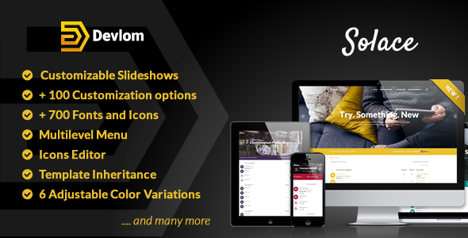

# Top Features

* **6 Presets** - Solace is coming with 6 predefined color presets. Each presets contains 17 elements which you can customize (ie: text color, background color etc).
* **Variations Switcher** - you can switch presets using Variations Switcher. With one click you can load another color scheme from forum Menu.
* **Logo** - you can select various logo options, starting from logo image to text based logos. In Devlom Configurator logo section you can also choose font, font sizes, logo width, height and many more.
* **Multilevel Menu** - you can create sophisticated menus with icons, 4 level dropdowns and submenus.
* **TopBar** - topbar can be either placed in fixed position or sticky at the top of the page.
* **Slideshows** - slideshows are our flagship feature. You can create unlimited slideshow items, assign text and description and adjust various settings like fonts, font sizes, decide if you want to display slideshow on forum index or on every page, adjust width, height and many more.
* **Blazing Fast** - on the backside, solace is based on [Symfony's](https://symfony.com/) best components which provides optimal performance and overall quality.
* **Devlom Configurator** - Devlom Configurator is our advanced extension which provides over 100 options to customize your Solace style.
* **Icons Editor** - part of Devlom Configurator extension, provides an easy way to set custom icon for various topic and forum states ie: sticky, locked, mine etc. 50 forum and topic states available.
* **700 Fonts** - around 700 fonts to choose from [Google Fonts](https://www.google.com/font) library for various forum parts ie: menu, body, logo etc..
* **Social Icons** - set social icons to keep in touch with your friends and customers
* **Customizable Footer** - adjust footer to your needs, customize menu links and content.
* **FeedBurner** - FeedBurner email subscription support.
* **Responsive** - Solace was tested on huge variety of different mobile devices.
* **RTL** - support for language written in a Right-To-Left (RTL) is implemented by default.
* **High Resolution** - Solace is ready for high resolution devices.
* **Template Inheritance** - unlike other phpBB styles, Solace is based on core template inheritance. This major feature dramatically increases extensions compatibility and makes easy to update Solace in the feature. For example, other styles includes around 150 (!) files inside their templates folder. This makes phpBB updating very difficult and long process. We included only 3 files. Rest is automatically inherited from prosilver. When you update your phpBB to newer version, Solace will be updated as well. Only minor changes might be needed.
* **Prosilver CSS ordering** - instead of complicating things with additional scss, less setups, we included css files the way it's done in prosilver (default phpBB style). No scss, less recompiling needed. Style modification is easy as pie :)
* **Multi Language** - Solace supports all languages (around 50) provided by [phpbb.com](https://www.phpbb.com/languages/)
* **FontAwesome and ET Line-Style Icons included** - two font icon libraries included with Solace gives you opportunity to assign around 700 icons to various forum parts.
* **Documentation** - style download contains detailed documentation for beginners and for advanced users.

# Demo
http://demo.devlom.com/phpbb3/solace

# phpBB version support

Solace is compatible with phpBB 3.1.x, 3.2.x, and 3.3.x. The style has been updated to ensure full compatibility with modern phpBB versions while maintaining backwards compatibility.

# Installation

``solace`` -> upload to ``phpbb3/styles/``

``devlom`` -> upload to ``phpbb3/ext/``

Install style and extension. Enjoy. Read ``documentation`` for detailed install instructions.
